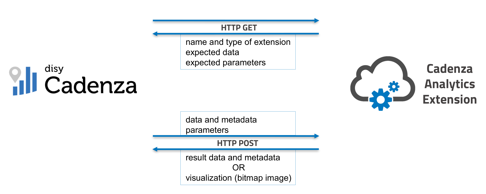

<pre>    
    <b>!! This module is currently in beta status !!</b>

    It can be used for testing, but there may be breaking changes before a full release.
    This documentation is still under developement as well.
</pre>


# disy Cadenza Analytics Extensions

An Analytics Extension extends the functional spectrum of [disy Cadenza](https://www.disy.net/en/products/disy-cadenza/){target="_top"} with an analysis function or a visualisation type. 
An Analytics Extension is a web service that exchanges structured data with disy Cadenza via the Cadenza API. 
A user can integrate an analysis extension into disy Cadenza via the Management Center and manage it there (if they have the appropriate rights).

As of disy Cadenza Autumn 2023 (9.3), the following types and capabilities of analysis extensions are officially supported:

- **Visualization** 
  The Analytics Extension type `visualization` provides a new visualization type for displaying a bitmap image (PNG).

- **Data enrichment**
  The Analytcs Extension type `enrichment` returns data that enriches an existing Cadenza object type by adding additional attributes, which virtually add additional columns to the original data set.

- **Data generation**
  The Analytics Extension type `calculation` provides a result data set that is created as a new Cadenza object type.

## Communication

An Analytics Extension defines one endpoint that, depending on the HTTP method of the request, is used to supply the Extension's configuration to disy Cadenza, or exchange data and results with Cadenza respectively.

<!--- Beware: when building documentation locally, path to image must not be relative to this document, but relative to the one that includes this md file! 
             (in this case: src/cadenzaanalytics/__init__.py  ->  


When receiving an `HTTP(S) GET` request, the endpoint returns a JSON representation of the extention's configuration. This step is executed once when registering the Analytics Extension from the disy Cadenza Management Center GUI and does not need to be repeated unless the extension's configuration changes.

By sending an `HTTP(S) POST` request to the same endpoint and including the data, metadata and parameters as specified in the extension's configuration as payload, the extension is executed. This step is executed each time that the Analytics Extension is invoked from the disy Cadenza GUI and Cadenza takes care of properly formatting the payload.

The `cadenzaanalytics` module provides the functionality to abstract the required communication and easily configure the Analytics Extension's responses to the above requests. 


# Installation

As long as this package is in beta, it is only available on GitHub, and an installation via source is necessary. In the near future this package will also be made available via the Python Package Index (PyPI). 

Furthermore, a corresponding version will be packaged as source code with each release of disy Cadenza.

## Requirements and Dependencies

The `cadenzaanalytics` package has the following dependencies:

* Python 3
* [Flask](https://flask.palletsprojects.com/en/3.0.x/)
* [Pandas](https://pandas.pydata.org/)
* requests-toolbelt

For each disy Cadenza version, the correct corresponding library version needs to be used.
The disy Cadenza main version is reflected in the corresponding major and minor version of `cadenzaanalytics` (e.g. 10.4.0 for Cadenza 10.4), while the last version segment is increased for both bugfixes and functional changes.

For Cadenza 10.2 and earlier versions, `cadenzaanalytics` used a semantic versioning scheme. 
The first version of disy Cadenza that supported Analytics Extensions is disy Cadenza Autumn 2023 (9.3). 

<!-- 
## Installation via PyPI

The simplest way to install `cadenzaanalytics` is from the [Python Package Index (PyPI)](https://pypi.org/project/cadenzaanalytics/) using the package installer [`pip`](https://pypi.org/project/pip/). To install the most recent version, simply execute
```console
pip install cadenzaanalytics
```

In order to install a specific version of `cadenzaanalytics`, e.g. to develop an Analytics Extension for an older version of disy Cadenza, specify the version in the `pip` call:

```console
pip install cadenzaanalytics==0.1.21
```
-->


## Installation from Source
The source of the package can be obtained from the project's public [GitHub repository](https://github.com/DisyInformationssysteme/cadenza-analytics-python). Alternatively with each release of disy Cadenza, the offline source code of the matching version of `cadenzaanalytics` is packaged in the distributions `developer.zip`.

Once the repository is locally available, the package can be installed using the package installer [`pip`](https://pypi.org/project/pip/). 
To install the package from source, navigate to the root folder of the project and run:

```console
pip install .
```


# Usage

The following code snippets show the steps that are needed to develop and deploy custom functionality as a disy Cadenza Analytics Extension.

Full, working examples can be found in the [module's GitHub repository](https://github.com/DisyInformationssysteme/cadenza-analytics-python/tree/main) in the `examples` folder.

Initially, the module must be imported:

```python
import cadenzaanalytics as ca
```


## Defining Expected Data

We specify what data can be passed from disy Cadenza to the Anylytics Extension by defining an [`AttributeGroup()`](cadenzaanalytics/data/attribute_group.html).

```python
my_attribute_group = ca.AttributeGroup(
                         name='my_data',
                         print_name='Any numeric attribute',
                         data_types=[ca.DataType.INT64, 
                                     ca.DataType.FLOAT64],
                         min_attributes=1,
                         max_attributes=1
                     )
```

This object requires a `name`, a `print_name` and a list defining the possible [`DataType`](cadenzaanalytics/data/data_type.html) that will later be available for selection in disy Cadenza when invoking the extension's execution.
Optionally, the number of individual attributes (i.e. data columns) that may be passed to the extension as part of the `AttributeGroup` can be constrained.

Generally, one `AttributeGroup` can contain multiple attributes and multiple `AttributeGroup` objects may be defined.

## Defining Expected Parameters

An extension may or may not require parametrization beyond the actual data that is passed to it.

A parameter can be optionally defined by creating a [`Parameter()`](cadenzaanalytics/data/parameter.html) object.


```python
my_param = ca.Parameter(
               name='flag',
               print_name='Some flag that my analysis needs',
               parameter_type=ca.ParameterType.BOOLEAN,
               default_value='True'
           )
```
This object again requires a `name` and a `print_name`, as well as a [`ParameterType`](cadenzaanalytics/data/parameter_type.html).
Optionally, we can specify whether a parameter is mandatory and/or a default value for it.
Multiple parameters can be defined. 

As an alternative to requesting input of a parameter in one of the standard data types, a list from which a user selects a value can be defined via the `SELECT` type:

```python
my_param2 = ca.Parameter(
                name='dropdown',
                print_name='Select option'
                parameter_type=ca.ParameterType.SELECT,
                required=True,
                default_value='Option 1',
                options=['Option 1', 'Option 2', 'Option 3']
            )
```

Note: Parameters for Analytics Extensions of the type `visualization` can currently *not* yet be assigned on the disy Cadenza side when displaying the visualization as a Cadenza view.

## Configuring the Extension

To specify the endpoint where the extension expects to receive from disy Cadenza and tie the previous configuration together, a [`CadenzaAnalyticsExtension()`](cadenzaanalytics/cadenza_analytics_extension.html) must be defined.

```python
my_extension = ca.CadenzaAnalyticsExtension(
                   relative_path='my-extension',
                   print_name='My extension\'s print name in Cadenza',
                   extension_type=ca.ExtensionType.CALCULATION,
                   attribute_groups=[my_attribute_group],
                   parameters=[my_param, my_param2],
                   analytics_function=my_analytics_function
               )
```

The `relative_path` defines the endpoint, i.e. the subdirectory of the URL under wich the extension will be available after deployment.
Further parameters include the `print_name` shown in Cadenza, and the attribute groups and parameters defined above. 
Additionally, the appropriate [`ExtensionType`](cadenzaanalytics/data/extension_type.html) (visualization, enrichment, or calculation) must be specified.

The `analytics_function` is the name of the Python method that should be invoked (see next section).

## Including Custom Analytics Code

The analysis function `my_analytics_function` (or whatever you choose to name it) is the method that contains the specific functionality for the extension.
It implements what the extension should be doing when being invoked from disy Cadenza. 
This method takes two arguments, `metadata` and `data`, which both will be passed to it automatically when the extension is invoked from Cadenza.

```python
def my_analytics_function (metadata: ca.RequestMetadata, data: pd.DataFrame):
    # do something
    return #something
```

The actual content and return type of this function will depend both on the extension type (visualization, enrichment, or calculation) and naturally the actual analytics code that the extension should execute. 

### Reading Data, Metadata and Parameters

Accessing the data that is transferred from Cadenza is simple.
Within the defined analytics function, a [Pandas DataFrame](https://pandas.pydata.org/) `data` is automatically available, which holds all the data passed from Cadenza.

Same as the `data` object, a [`RequestMetadata`](cadenzaanalytics/request/request_metadata.html) object is also automatically available in the analysis function as `metadata`. 

The `metadata` object contains information on the columns in the `data` DataFrame, such as their print name and type in disy Cadenza, their column name in the pandas DataFrame, or additional information like a `geometry_type`, where applicable.

This information can be used to access the `data` DataFrame's columns by the attribute group's name.

```python
columns_by_attribute_group = metadata.get_columns_by_attribute_group()

if 'my_data' in columns_by_attribute_group:
    for column in columns_by_attribute_group['my_data']:
        my_data = data[column.name]
```

While it is also possible to directly access the columns of `data` by name or by index, this is less robust, since the actual column names of the dataframe depend on their configuration in disy Cadenza and changing them there might lead to the extension not functioning properly anymore. However it is possible to get the metadata to a specific colum of the `data` DataFrame.

```python
for column_name, column_data in data.items():
    column_metadata = metadata.get_column(column_name)
```


Currently, the following Cadenza attribute types can be passed to an Analytics Extension.
The table shows the mapping to Pyton data types:

| Cadenza Attribute Type              | Pandas Column Type |  Example Value       | Notes |
|-------------------------------------|-----------|--------------------------|-------|
| Text (String)                       | string    | `"Text"`                 | |
| Number (Integer)                    | pandas.Int64Dtype     | `1`                      | |
| Number (Long)                       | pandas.Long64Dtype    | `1`                      | |
| Floating point number (Double)      | pandas.Float64Dtype   | `1.23`                   | |
| Date                                | string    | `"2022-11-12T12:34:56+13:45[Pacific/Chatham]"` | A date is represented as an [ISO string with time zone offset from UTC](https://en.wikipedia.org/wiki/ISO_8601#Coordinated_Universal_Time_(UTC)) (UTC) and additional time zone identifier in brackets. |
| Geometry                            | string    | `"POINT(8.41594949941623 49.0048124984033)"` | A geometry is represented as a [WKT](https://en.wikipedia.org/wiki/Well-known_text_representation_of_geometry) string.<br><br>*Note:* By default, coordinates use the WGS84 projection. | 


Parameters are stored in `metadata` as well. They are always passed as `string` and can be read through the [`RequestMetadata`](cadenzaanalytics/request/request_metadata.html) methods `get_parameter` for a single parameter, respectively `get_parameters` for a dictionary of all parameters.

```python
param_flag = metadata.get_parameter('flag')
```

## Returning Data

Depending on the extension type, there are specific objects for returning the response.

### Data Generation

A [`CsvResponse`](cadenzaanalytics/response/csv_response.html) is used for calculations.
The response must include the data and the proper metadata.

The following minimal example echos the data received from disy Cadenza as part of an `AttributeGroup` named `'any_data'` back to it without modification.

```python
def echo_analytics_function(metadata: ca.RequestMetadata, data: pd.DataFrame):
    return ca.CsvResponse(data, metadata.get_all_columns_by_attribute_group()['my_data'])
```

For a real extension with actually calculated data, the `metadata` is built as a list of [`ColumnMetadata()`](cadenzaanalytics/data/column_metadata.html) objects:

```python
response_columns = [
    ca.ColumnMetadata(
        name='Geometry',
        print_name='Geometry',
        attribute_group_name='geo',
        data_type=ca.DataType.GEOMETRY,
        role=ca.AttributeRole.DIMENSION,
        geometry_type=ca.GeometryType.POLYGON
    ),
    ca.ColumnMetadata(
        name='WeightedValue',
        print_name='Value (IDW)',
        attribute_group_name='value',
        data_type=ca.DataType.FLOAT64,
        role=ca.AttributeRole.MEASURE,
        measure_aggregation=ca.MeasureAggregation.AVERAGE
    )
]
```

### Data Enrichment

A [`CsvResponse`](cadenzaanalytics/response/csv_response.html) is used for enrichments as well.
The response must be in the format of a text, a CSV file or a DataFrame so that it fits. 

TODO

The metadata must be adapted and also returned to disy Cadenza via the response method.

TODO

### Visualization
As result of a visualization extension, an [`ImageResponse`](cadenzaanalytics/response/image_response.html) must be returned.
Visualization extensions return a bitmap image in PNG format.

The image can be created in various ways, e.g. by using FigureCanvas from matplotlib to render a plot or image.
The following snippet shows returning an image loaded from a file.

```python
with open("example_image.png", "rb") as image_file:
    image = image_file.read()

return ca.ImageResponse(image)
```


### Returning an Error
In order to abort the execution of the function with an error and pass an according message to disy Cadenza, a [`ErrorResponse`](cadenzaanalytics/response/error_response.html) can be returned.

```python
if my_data is None:
        return ca.ErrorResponse('Didn\'t find expected attribute "my_data".', 400)
```

## Registering the Extension

TBD

```python
analytics_service = ca.CadenzaAnalyticsExtensionService()
analytics_service.add_analytics_extension(my_extension)
```

TODO "directory" service multiple extensions

# Deployment 

Since `cadenzaanalytics` is built on the [Flask framework](https://flask.palletsprojects.com/en/3.0.x/), ...

## Local Execution

```python
if __name__ == '__main__':
    analytics_service.run_development_server(8090)

```

## WSGI Deployment
